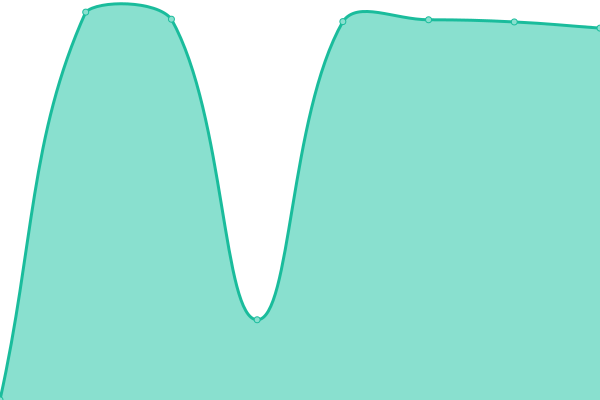
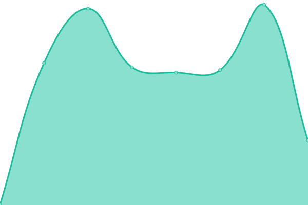
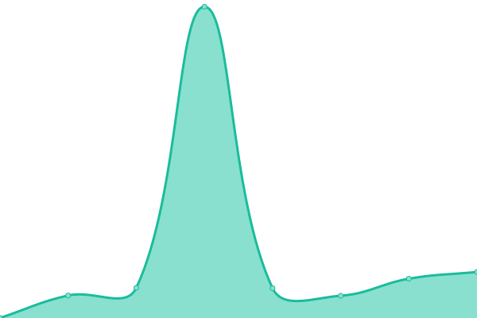
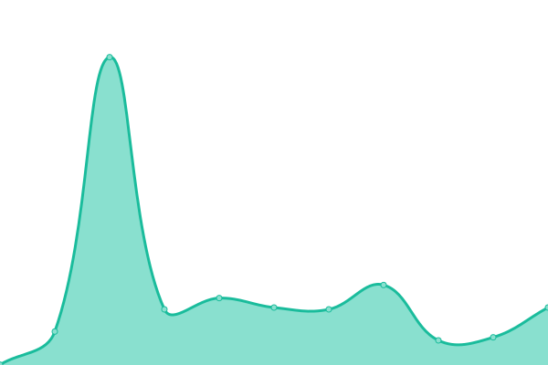

# [📈 Live Status](https://upptime.saiyans.com.ve): <!--live status--> **🟧 Partial outage**

This repository contains the open-source uptime monitor and status page for [Tomás A. Márquez L.](saiyans.com.ve), powered by [Upptime](https://github.com/upptime/upptime).

With [Upptime](https://upptime.js.org), you can get your own unlimited and free uptime monitor and status page, powered entirely by a GitHub repository. We use [Issues](https://github.com/tomasmetal23/upptime/issues) as incident reports, [Actions](https://github.com/tomasmetal23/upptime/actions) as uptime monitors, and [Pages](https://upptime.saiyans.com.ve) for the status page.

<!--start: status pages-->
<!-- This summary is generated by Upptime (https://github.com/upptime/upptime) -->
<!-- Do not edit this manually, your changes will be overwritten -->
<!-- prettier-ignore -->
| URL | Status | History | Response Time | Uptime |
| --- | ------ | ------- | ------------- | ------ |
|  [Saiyans Blog](https://blog.saiyans.com.ve) | 🟩 Up | [saiyans-blog.yml](https://github.com/tomasmetal23/upptime/commits/HEAD/history/saiyans-blog.yml) | 

 10685ms
     
 | 

<a href="https://upptime.saiyans.com.ve/history/saiyans-blog">100.00%</a>
    

|  [Project-Kualinet](https://api1.kualinet.com) | 🟩 Up | [project-kualinet.yml](https://github.com/tomasmetal23/upptime/commits/HEAD/history/project-kualinet.yml) | 

 274ms
     
 | 

<a href="https://upptime.saiyans.com.ve/history/project-kualinet">86.64%</a>
    

|  [Project-Virtual Room](https://virtualroom.abc-ehr.com) | 🟩 Up | [project-virtual-room.yml](https://github.com/tomasmetal23/upptime/commits/HEAD/history/project-virtual-room.yml) | 

 938ms
     
 | 

<a href="https://upptime.saiyans.com.ve/history/project-virtual-room">100.00%</a>
    

|  [Bitwarden](https://bitwarden.saiyans.com.ve) | 🟩 Up | [bitwarden.yml](https://github.com/tomasmetal23/upptime/commits/HEAD/history/bitwarden.yml) | 

 290ms
     
 | 

<a href="https://upptime.saiyans.com.ve/history/bitwarden">100.00%</a>
    

|  [DNS Saiyans](104.238.137.12) | 🟥 Down | [dns-saiyans.yml](https://github.com/tomasmetal23/upptime/commits/HEAD/history/dns-saiyans.yml) | 

 0ms
     
 | 

<a href="https://upptime.saiyans.com.ve/history/dns-saiyans">0.00%</a>
    

|  [Meet Saiyans](https://meet.saiyans.com.ve) | 🟥 Down | [meet-saiyans.yml](https://github.com/tomasmetal23/upptime/commits/HEAD/history/meet-saiyans.yml) | 

 287ms
     
 | 

<a href="https://upptime.saiyans.com.ve/history/meet-saiyans">0.00%</a>
    

|  [Https file mirror](https://mirror.saiyans.com.ve) | 🟩 Up | [https-file-mirror.yml](https://github.com/tomasmetal23/upptime/commits/HEAD/history/https-file-mirror.yml) | 

 228ms
     
 | 

<a href="https://upptime.saiyans.com.ve/history/https-file-mirror">100.00%</a>
    

|  [Real-time Markdown editor](https://notas.saiyans.com.ve) | 🟩 Up | [real-time-markdown-editor.yml](https://github.com/tomasmetal23/upptime/commits/HEAD/history/real-time-markdown-editor.yml) | 

 579ms
     
 | 

<a href="https://upptime.saiyans.com.ve/history/real-time-markdown-editor">100.00%</a>
    

|  [VPN Saiyans](104.238.137.12) | 🟥 Down | [vpn-saiyans.yml](https://github.com/tomasmetal23/upptime/commits/HEAD/history/vpn-saiyans.yml) | 

 0ms
     
 | 

<a href="https://upptime.saiyans.com.ve/history/vpn-saiyans">0.00%</a>
    

<!--end: status pages-->

[**Visit our status website →**](https://upptime.saiyans.com.ve)

## 📄 License

- Powered by: [Upptime](https://github.com/upptime/upptime)
- Code: [MIT](./LICENSE) © [Tomás A. Márquez L.](saiyans.com.ve)
- Data in the `./history` directory: [Open Database License](https://opendatacommons.org/licenses/odbl/1-0/)
