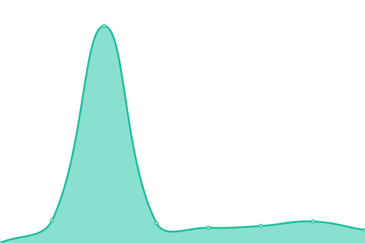

# [📈 Live Status](https://upptime.saiyans.com.ve): <!--live status--> **🟧 Partial outage**

This repository contains the open-source uptime monitor and status page for [Tomás A. Márquez L.](saiyans.com.ve), powered by [Upptime](https://github.com/upptime/upptime).

With [Upptime](https://upptime.js.org), you can get your own unlimited and free uptime monitor and status page, powered entirely by a GitHub repository. We use [Issues](https://github.com/tomasmetal23/upptime/issues) as incident reports, [Actions](https://github.com/tomasmetal23/upptime/actions) as uptime monitors, and [Pages](https://upptime.saiyans.com.ve) for the status page.

<!--start: status pages-->
<!-- This summary is generated by Upptime (https://github.com/upptime/upptime) -->
<!-- Do not edit this manually, your changes will be overwritten -->
<!-- prettier-ignore -->
| URL | Status | History | Response Time | Uptime |
| --- | ------ | ------- | ------------- | ------ |
|  [Saiyans Blog](https://blog.saiyans.com.ve) | 🟩 Up | [saiyans-blog.yml](https://github.com/tomasmetal23/upptime/commits/HEAD/history/saiyans-blog.yml) | 

 807ms
     
 | 

<a href="https://upptime.saiyans.com.ve/history/saiyans-blog">100.00%</a>
    

|  [Bitwarden](https://bitwarden.saiyans.com.ve) | 🟩 Up | [bitwarden.yml](https://github.com/tomasmetal23/upptime/commits/HEAD/history/bitwarden.yml) | 

 293ms
     
 | 

<a href="https://upptime.saiyans.com.ve/history/bitwarden">100.00%</a>
    

|  Https file mirror | 🟩 Up | [https-file-mirror.yml](https://github.com/tomasmetal23/upptime/commits/HEAD/history/https-file-mirror.yml) | 

 317ms
     
 | 

<a href="https://upptime.saiyans.com.ve/history/https-file-mirror">100.00%</a>
    

|  [Real-time Markdown editor](https://notas.saiyans.com.ve) | 🟥 Down | [real-time-markdown-editor.yml](https://github.com/tomasmetal23/upptime/commits/HEAD/history/real-time-markdown-editor.yml) | 

 547ms
     
 | 

<a href="https://upptime.saiyans.com.ve/history/real-time-markdown-editor">28.75%</a>
    

|  [Tor](https://tor.saiyans.com.ve) | 🟩 Up | [tor.yml](https://github.com/tomasmetal23/upptime/commits/HEAD/history/tor.yml) | 

 275ms
     
 | 

<a href="https://upptime.saiyans.com.ve/history/tor">100.00%</a>
    

|  [Trojan](https://trojan.saiyans.com.ve) | 🟩 Up | [trojan.yml](https://github.com/tomasmetal23/upptime/commits/HEAD/history/trojan.yml) | 

 233ms
     
 | 

<a href="https://upptime.saiyans.com.ve/history/trojan">100.00%</a>
    

<!--end: status pages-->

[**Visit our status website →**](https://upptime.saiyans.com.ve)

## 📄 License

- Powered by: [Upptime](https://github.com/upptime/upptime)
- Code: [MIT](./LICENSE) © [Tomás A. Márquez L.](saiyans.com.ve)
- Data in the `./history` directory: [Open Database License](https://opendatacommons.org/licenses/odbl/1-0/)
